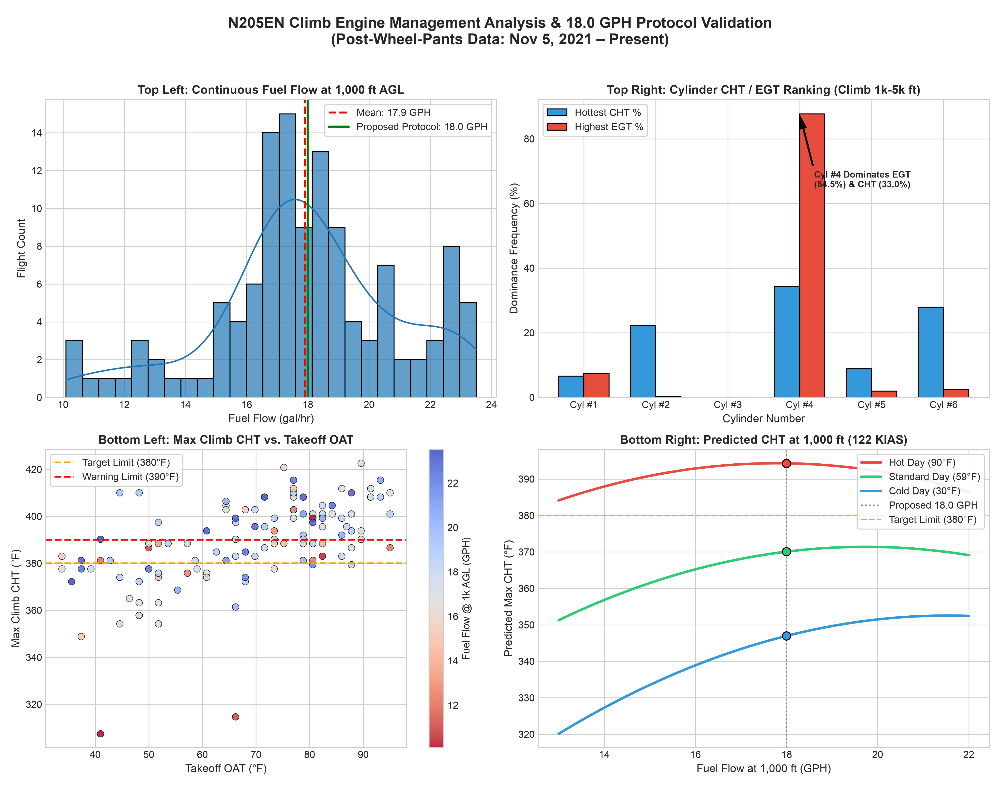

# Engineering Report: N205EN Engine Climb Thermal Analysis & Baffle Optimization

**Aircraft**: Van's RV-10 (**N205EN**)  
**Engine**: Lycoming IO-540-D4A5 with Air Flow Performance (AFP) Fuel Injection System  
**Analysis Dataset**: Phase 2 Parquet Telemetry (November 5, 2021 – Present, 6.42M Telemetry Rows, 348,381 Active Climb Data Points)  

---

## 🎯 Executive Summary

Empirical analysis of 348,381 active climb data points confirms that climb CHT exceedances ($> 380^\circ\text{F}$) in N205EN are driven by **ambient air temperature (OAT)**, **climb airspeed (IAS)**, **takeoff fuel flow (GPH)**, and **baffle airflow distribution** in front of Cylinder 2.

> [!IMPORTANT]
> **CURRENT ACTIVE CLIMB & BAFFLE STATUS (As of August 10, 2026)**
> * **Active Takeoff & Climb Protocol**: Keep Throttle WOT (**29.0"+ MAP**) and Prop **FULL FORWARD (2600 RPM)** up to 1,000+ ft AGL, maintaining **23.0 – 23.5 GPH full-rich fuel cooling**. At 1,000 ft AGL, pitch down for **125 – 135 KIAS** en-route climb.
> * **Current Baffle Hardware Mod**: Test Air Dam installed on `CB-1002B` left ramp angle in front of Cylinder 2.
> * **Latest Flight Test Result (Aug 10, 2026)**: Cylinder 2 dropped from tied #1 hottest cylinder down **behind Cylinder 4** (Cyl 2 CHT dropped to **404.6°F** @ 135 kts vs Cyl 4/6 @ **408.2°F**).
> * **Next Active Baffle Refinement**: Trim Air Dam down to an **Isosceles Trapezoid** shape (~1.25" center height, blocking lower 1/3 of the 9 tall fins, tapering on left to clear black steel barrel and on right near fuel injector fitting).

---

## 📊 Summary Visual Deliverable (Historical Dataset)



*Figure 1: 2x2 Summary Visualization showing continuous Fuel Flow distribution at 1,000 ft AGL [Top Left], Cylinder CHT/EGT ranking distribution [Top Right], Max CHT vs. Takeoff OAT colored by Fuel Flow [Bottom Left], and Model-Predicted CHT vs. Fuel Flow at 1,000 ft AGL [Bottom Right].*

---

## 🔍 Historical Baseline & Cylinder Dominance Analysis

Across **348,381 active climb telemetry points** (1,000 to 5,000 ft MSL, Vertical Speed $> 300$ FPM, IAS $> 60$ kt):

### Overall Cylinder Ranking & Dynamics
| Cylinder | Hottest CHT Frequency (%) | Highest EGT Frequency (%) | Role & Historical Dynamics |
| :--- | :---: | :---: | :--- |
| **Cylinder 1** | 6.6% | 7.5% | Secondary front cylinder (Clean airflow inlet) |
| **Cylinder 2** | **22.3%** | 0.3% | 🔴 **Major CHT Problem Child** (Ramp blow-by & prop swirl) |
| **Cylinder 3** | 0.0% | 0.1% | Well-cooled mid cylinder |
| **Cylinder 4** | **34.3%** | **87.7%** | 🔴 **Primary Control Cylinder & Undisputed EGT Leader** |
| **Cylinder 5** | 8.9% | 2.0% | Secondary rear cylinder |
| **Cylinder 6** | **27.9%** | 2.4% | 🟡 Leading CHT under cool OAT conditions |

### OAT Dependency Breakdown
| Takeoff OAT Condition | Cyl #1 | Cyl #2 | Cyl #4 | Cyl #5 | Cyl #6 | Primary Hottest CHT |
| :--- | :---: | :---: | :---: | :---: | :---: | :--- |
| **Cold ($< 40^\circ\text{F}$)** | 4.8% | 29.4% | **45.9%** | 2.9% | 17.0% | **Cyl #4 Dominates** |
| **Cool ($40^\circ\text{F} - 60^\circ\text{F}$)** | 9.7% | 21.3% | 21.6% | 10.1% | **37.3%** | **Cyl #6 Dominates** |
| **Warm ($60^\circ\text{F} - 80^\circ\text{F}$)** | 5.0% | 20.8% | **38.5%** | 8.9% | 26.7% | **Cyl #4 Dominates** |
| **Hot ($> 80^\circ\text{F}$)** | 9.6% | 20.8% | **29.3%** | 17.3% | 22.9% | **Cyl #4 Dominates** |

---

## ⛽ Historical Practice vs. Predictive Thermal Model

### Continuous Fuel Flow Distribution (Historical)
- **Passing 1,000 ft AGL**: Mean = **17.92 GPH**, Median = **17.80 GPH** (Range: 10.1 – 23.5 GPH).
- **At 3,000 ft MSL**: Mean = **16.10 GPH**
- **At 5,000 ft MSL**: Mean = **15.42 GPH**
- **Climb CHT Exceedances**: Max CHT $> 380^\circ\text{F}$ occurred in **74.8% of flights**; $> 390^\circ\text{F}$ in **52.0% of flights**.

### Predictive Regression Model
$$\text{Max\_CHT} = f(\text{Fuel\_Flow}, \text{Airspeed\_IAS}, \text{Takeoff\_OAT}, \text{Altitude})$$

| OAT Condition | Takeoff OAT | Predicted CHT @ 1k AGL | Target Limit ($380^\circ\text{F}$) Margin | Recommendation |
| :--- | :---: | :---: | :---: | :--- |
| **Cold Winter Day** | $30.0^\circ\text{F}$ | **$347.0^\circ\text{F}$** | **$+33.0^\circ\text{F}$** | **SAFE** ($< 380^\circ\text{F}$) |
| **Standard Day** | $59.0^\circ\text{F}$ | **$370.1^\circ\text{F}$** | **$+9.9^\circ\text{F}$** | **SAFE** ($< 380^\circ\text{F}$) |
| **Hot Summer Day** | $90.0^\circ\text{F}$ | **$394.3^\circ\text{F}$** | **$-14.3^\circ\text{F}$** | **Requires $\ge 23.0$ GPH & 125–130 KIAS** |

---

## 📅 Flight Test Iteration 1: August 9, 2026 (Previous Protocol Evaluation)

### 🛠️ Execution & Telemetry Summary
* **Environmental OAT**: **93.2°F (34.0°C)** on takeoff roll.
* **Procedure Executed**: Takeoff roll started at 23.1 GPH. At ~250–400 ft AGL (16:55:30 UTC), power was pulled back to **25.8" MAP and 2415 RPM** in an attempt to tame engine noise/heat.

#### Empirical Telemetry Telemetry Sequence (Aug 9):
1. **16:55:17 (0 ft MSL)**: WOT 29.3" MAP, 2575 RPM, **FF = 23.1 GPH** (Full Rich). CHT = 393.8°F.
2. **16:55:40 (328 ft MSL)**: Throttle/Prop reduced to 27.0" MAP / 2412 RPM. **FF dropped to 20.5 GPH**. CHT rose to 408.2°F.
3. **16:55:50 (493 ft MSL)**: MAP = 25.8", RPM = 2415 RPM. **FF choked down to 18.5 GPH**.
4. **16:56:00 (662 ft MSL)**: CHT spiked to **411.8°F** on Cylinders 2 and 4!

### 💡 Key Physics Finding (The Fuel Cooling Paradox)
On a mechanical fuel injection system (AFP/Bendix), fuel flow is metered by air mass flow (MAP & RPM). Throttling back to 25.8" MAP at 400 ft AGL reduced engine power by ~15%, but **stripped away 4.6 GPH of liquid fuel cooling** (23.1 GPH $\rightarrow$ 18.5 GPH) while airspeed was still low (108 kts). This removed internal evaporative cooling, causing CHTs to spike to **411.8°F**.

---

## 📅 Flight Test Iteration 2: August 10, 2026 (Revised Protocol + Air Dam Test)

### 🛠️ Modifications & Protocol Executed
1. **Baffle Hardware Installed**: Test Air Dam (2.5" tall aluminum plate) mounted on `CB-1002B` left ramp angle in front of Cylinder 2.
2. **Engine Management Protocol**:
   * **Throttle**: Maintained **WOT (28.2 – 29.0" MAP)** to 2,500 ft MSL.
   * **Propeller**: Maintained **FULL FORWARD (2590 – 2603 RPM)** to 2,500 ft MSL.
   * **Fuel Flow**: Pegged at **23.1 – 23.3 GPH Full Rich**.
   * **Airspeed**: Pitched down at 1,000 ft AGL to accelerate to **130 – 138 KIAS** en-route climb.

### ✈️ Empirical Telemetry & Air Dam Evaluation (Aug 10)

| Metric | August 9 (NO Air Dam) | August 10 (WITH Air Dam) | Shift & Impact |
| :--- | :---: | :---: | :--- |
| **Ground Takeoff OAT** | 93.2°F | 87.8°F | -5.4°F cooler ambient |
| **Takeoff Fuel Flow** | 18.5 GPH *(choked)* | **23.3 GPH (Full Rich)** | **+4.8 GPH liquid fuel cooling** |
| **En-Route Climb IAS** | 118 – 120 kts | **130 – 138 kts** | **+15 kts ram-air cooling** |
| **Max Engine CHT** | 411.8°F (Cyl 2 & 4) | **413.6°F (Cyl 4)** | Thermal inertia peak @ 1,200 ft |
| **Cylinder 2 Peak CHT** | **411.8°F (Tied #1 Hottest)** | **411.8°F (Rank #2)** | 🟢 **Dropped BEHIND Cylinder 4!** |
| **Cylinder 2 @ 135 kts** | 410.0°F | **404.6°F** | 🟢 **Cooler than Cyl 4 & 6 (408.2°F)** |

### 🚀 Key Findings:
1. **Air Dam Success**: The Air Dam successfully trapped static pressure on the left ramp, forcing airflow through Cylinder 2's fins and **knocking Cylinder 2 out of the #1 hottest position**! Cylinder 4 is now the leading CHT on the engine.
2. **Revised Climb Protocol Success**: Maintaining 23.3 GPH and accelerating to 135 kts dropped CHTs from 413.6°F down to **< 404°F** within 60 seconds of level-off.

---

## 🚀 Path Forward: Air Dam Refinement (Isosceles Trapezoid Profile)

To optimize Cylinder 2 cooling further while exposing the upper 9 tall head fins to direct 135-knot ram air, refine the test air dam shape:

### Anatomical 4-Part Cylinder Breakdown & Trim Specifications:

```
                      [ Top Crest: ~1.25" High ]
                      (Blocks lower 1/3 of 9 Tall Fins)
                            ┌──────────────┐
                           /                \
  (Tapers down to         /                  \   (Tapers down low
   clear Black Barrel)   /                    \   near Injector Line)
  ──────────────────────┴──────────────────────┴──────────────────────
                   [ Flat Base Mounted to CB-1002B Ramp Angle ]
```

1. **Center Crest Height**: Trim top edge down from 2.5" to **~1.25" center height** (blocks only the lower 1/3 of the 9 tall fins, leaving the upper 2/3 exposed to direct 130-knot ram-air velocity).
2. **Left Side Taper**: Angle down 45° to clear the steel cylinder barrel (allows cooling air past piston skirt).
3. **Right Side Taper**: Angle down low to clear the fuel injector line and fitting (prevents vapor lock).
4. **Permanent Mounting**: Bond permanently using **JB Weld Original 8265S** + temporary safety-wire winch clamp / sheet metal screws, finished with flat black high-temp paint.

---

## 🛠️ Verification & Execution Details

- **Telemetry Source**: `n205en_engine_telemetry.parquet` & `flights_metadata.parquet`.
- **Analysis Script**: `scripts/analyze_climb_protocol.py`.
- **Plot Deliverable**: `climb_protocol_analysis.png`.
